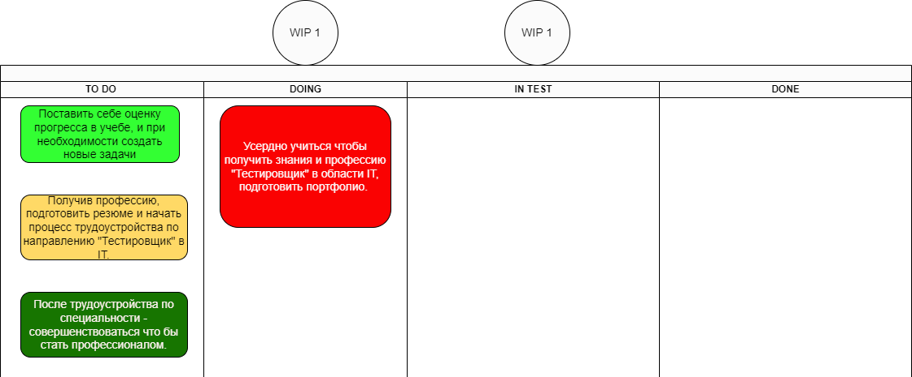

# Кейс:

Проанализируйте свой процесс обучения и продвижение по карьере в IT. 

Выделите задачи, которые стоят перед вами на месяц/квартал/год. 

Ранжируйте поставленные задачи по классам обслуживания, выберите цвета для Kanban-карточек. 

Определите WiP для управления потоком незавершённых задач. 

Добавьте задачи, которые вы определили, на личную Kanban-доску.

*На 1-ом уроке Александр Волчек хорошо сказал: "В GeekBrains учатся десятки тысяч человек, и наша задача чтобы люди достигали своей образовательной цели.*

*На наших программах обучения достичь образовательной цели максимально, можно, когда человек идет по определенной траектории, при этом у него возникают разные форматы обучения, и мы верим, что мир обучения информационным технологиям и современным профессиям возможен через различный формат обучения...*

*Студент очень сильно погружается в предментую область в которой он учится. И он абсолютно в другом формате, в другом тайменге. Студент начинает проходить то, что он никогда не изучал и начинает делать то что он никогда не делал. Или начинает делать действия, которые не понимает зачем он делает. Это могут быть абсолютно разные задачи...*

*Нам очень важно чтобы вы действительно, по-настоящему становились профессионалами.*

*Основная задача, для которой приходит человек-он всё же приходит получить профессию. И он хочет в рамках этой профессии стать профессионалом. Это может быть по-разному реализовано. Кто-то хочет сменить свою сферу деятельности и войти в другую сферу деятельности...*

*При этом при всем я могу сказать со стороны своей жизни и своего профессионального опыта, что очень важно делать то, что говорится делать. И мы в GeekBrains любые наши задачи, уроки, курсы, делаем не случайно. Мы в этом профессионально разбираемся — это огромная команда. Сотни человек делают обучение. Огромное количество экспертов, преподавателей, методологов, идеологов, и нам очень важно чтобы обучение проходило, чтобы оно двигало вас вперед.*

Я согласен с Александром Волчек, что очень важно делать то, что говорят делать профессионалы. Основная задача, для которой я пришел на платные курсы в GeekBrains это получить знания и профессию тестировщик в области IT. Я хочу сменить свою сферу деятельности и войти в другую, новую для меня сферу деятельности ИТ. Иногда я делаю действия, которые не понимаю зачем я делаю, но я не анализирую, а полагаюсь на команду профессионалов GeekBrains и делаю то, что говорят делать.

# Мои задачи:

Моя основная задача на ближайшие 3 месяца - усердно учиться и получить знания и профессию тестировщик в области IT, подготовить портфолио.

Вторая задача - в феврале-марте 2023 года(а так-же в процессе обучения, при наличии свободного времени) проанализировать процесс обучения, повторить предметы необходимые для трудоустройства и работы в сфере IT. Поставить себе оценку прогресса по этим направлениям (Что зашло в учебе - при необходимости создать новые задачи для повторения пройденного материала)

Третья задача - в марте 2023 года, получив профессию тестировщик, подготовить резюме, начать процесс трудоустройства, и в апреле 2023 года устроиться на работу по специальности.

Четвертая задача - в дальнейшем, после того как я устроюсь на работу по специальности, в рамках этой профессии самосовершенствоваться, чтобы стать профессионалом в области IT.

## Определяю для себя класс обслуживания и ожидания каждого рабочего элемента и цвет Kanban-карточки.
Для этого просто задаю вопрос: "Как много денег я теряю, если не сделю эту задачу вовремя?".

Выделяют 4 типа классов обслуживания,

Ускоренный (Красный цвет Kanban-карточки: Буду терять сразу и много.) – это срочные задачи с мгновенной стоимостью задержки. Обычно, такие задачи делают в первую очередь, откладывая все остальные, их пропускают вперед. Как правило, ускоренные задачи идут как +1 к количеству задач, определенному, как лимит работы в процессе.

Фиксированная дата (Зелёный цвет Kanban-карточки: Пока не наступит дедлайн, я не буду ничего терять.) – обычно это задачи с фиксированным дедлайном. При классе обслуживания "фиксированная дата" мы понимаем, что стоимость задержки резко возрастает после дедлайна.

Стандартный (Желтый цвет Kanban-карточки: Медленно теряю прибыль, если не сделаю эту работу.) — это наши стандартные задачи без зафиксированного дедлайна, при которых стоимость задержки будет повышаться плавно, приближаясь к дедлайну.

Нематериальный (Серый цвет Kanban-карточки: Ничего не потеряю, если не буду делать. Но, если таких задач накопится много, можно потерять работу(бизнес).) – Эти задачи не срочные и не обязательные (в данный момент). К такому классу задач обычно относят различного рода улучшения.

WIP-лимит это инструмент, используемый для фокуса команды на выполнении важных задач и обеспечения быстрого производственного потока. Он определяет, какое количество задач может одновременно находиться на конкретной стадии — производства или повседневной жизни.

WIP-лимитирование можно описать одним предложением: «Сделай больше в будущем, сделав меньше прямо сейчас» Ограничение побуждает закончить задачу до того, как перейти к другой. Именно это качество делает work-in-progress ограничение таким привлекательным в Agile и Kanban методологиях.

Work-in-progress ("Постоянное незавершенное производство"). Правило простое: новая задача поступает в производство только тогда, когда систему покидает очередное готовое изделие.

В этом случае обьём незавершённого производства будет оставаться постоянным

### Определяю для себя WIP-лимиты в кружках над колонками DOING and IN TEST:
Не более одной задачи может одновременно находиться в работе.
### Добавляю задачи на личную Kanban-доску:

